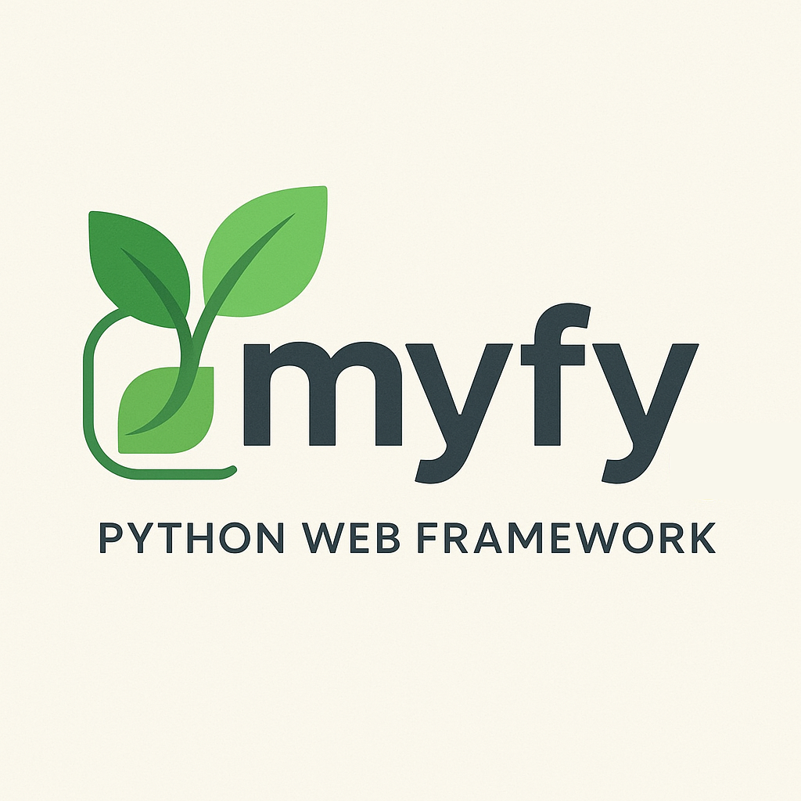

<div align="center">
  
</div>

# myfy

**Opinionated Python framework with modularity, ergonomics, and power**

---

## Why Another Framework?

You've built enough Python apps to know: FastAPI is brilliant for APIs but barebones for real apps. Django's too heavy and too coupled. Flask feels like duct tape.

What if you could have:

- **FastAPI's ergonomics** (decorators, type hints, async-first)
- **Enterprise-grade architecture** (DI container, module system, lifecycle)
- **Sensible defaults** (no config files until you need them)

myfy is that framework. Opinionated where it matters, flexible everywhere else.

---

## 60-Second Example

### Full-Stack App with Frontend

**Build a complete web app with DaisyUI components:**

```bash
# Initialize frontend (one-time setup)
uv run myfy frontend init
```

This creates `app.py` and `frontend/` with Tailwind 4 + DaisyUI 5:

```python
from myfy.core import Application
from myfy.web import WebModule, route
from myfy.frontend import FrontendModule, render_template
from starlette.requests import Request
from starlette.templating import Jinja2Templates

@route.get("/")
async def home(request: Request, templates: Jinja2Templates):
    return render_template(
        "home.html",
        request=request,
        templates=templates,
        title="Welcome to myfy"
    )

app = Application(auto_discover=False)
app.add_module(WebModule())
app.add_module(FrontendModule())
```

**Run it:**
```bash
uv run myfy run
```

Visit `http://127.0.0.1:8000` - styled UI with DaisyUI, instant HMR, ready to ship.


---

### API-Only Example

**Build a REST API with DI and validation:**

```python
from myfy.core import Application, provider, SINGLETON, BaseSettings
from myfy.web import route, WebModule
from pydantic import Field

# 1. Settings (auto-loads from .env)
class Settings(BaseSettings):
    app_name: str = Field(default="My App")
    api_key: str

# 2. Services (constructor-injected)
class UserService:
    def __init__(self, settings: Settings):
        self.settings = settings

    def greet(self, name: str) -> str:
        return f"Hello {name} from {self.settings.app_name}!"

@provider(scope=SINGLETON)
def user_service(settings: Settings) -> UserService:
    return UserService(settings)

# 3. Routes (DI + path params + type conversion)
@route.get("/greet/{name}")
async def greet_user(name: str, service: UserService) -> dict:
    return {"message": service.greet(name)}

# 4. Run
app = Application(settings_class=Settings, auto_discover=False)
app.add_module(WebModule())
```

**Run it:**
```bash
echo "API_KEY=secret123" > .env
uv run myfy run
```

Visit `http://127.0.0.1:8000/greet/World`

---

## What Makes myfy Different

### Modules That Actually Work
Real, composable modules with their own lifecycle - not "blueprints":

```python
class DataModule(BaseModule):
    async def start(self):
        await self.db.connect()

    async def stop(self):
        await self.db.disconnect()

app.add_module(DataModule())
app.add_module(WebModule())
```

### Dependency Injection Without Magic
Type-based DI that's fast (zero reflection on hot path) and safe (compile-time validation):

```python
@provider(scope=SINGLETON)
def database(settings: Settings) -> Database:
    return Database(settings.db_url)

@route.post("/users")
async def create_user(body: CreateUserDTO, db: Database):
    return await db.create_user(body)
```

### Defaults That Make Sense
One file. No config. Just run.

---

## Getting Started

<div class="grid cards" markdown>

-   :material-clock-fast:{ .lg .middle } __Installation__

    ---

    Install myfy and create your first app in 5 minutes

    [:octicons-arrow-right-24: Get Started](getting-started/installation.md)

-   :material-book-open-variant:{ .lg .middle } __Tutorial__

    ---

    Build a complete application step-by-step

    [:octicons-arrow-right-24: Full Tutorial](getting-started/tutorial.md)

-   :material-lightning-bolt:{ .lg .middle } __Reference__

    ---

    Single-page reference for all myfy features

    [:octicons-arrow-right-24: Reference](reference.md)

-   :material-cog:{ .lg .middle } __Core Concepts__

    ---

    Deep dive into DI, modules, configuration, and lifecycle

    [:octicons-arrow-right-24: Learn More](core-concepts/dependency-injection.md)

-   :material-robot:{ .lg .middle } __Claude Code Plugin__

    ---

    AI-assisted development with skills, agents, and commands

    [:octicons-arrow-right-24: Install Plugin](https://code.claude.com/docs/en/discover-plugins)

</div>

---

## Key Features

| Feature | Description |
|---------|-------------|
| **Type-Safe DI** | Constructor injection with `SINGLETON`, `REQUEST`, and `TASK` scopes |
| **Module System** | First-class modules with lifecycle hooks (start/stop) |
| **FastAPI-Style Routes** | Decorators, path params, automatic body parsing |
| **Query Validation** | Built-in query parameter parsing with constraints (ge, le, min_length, pattern) |
| **WebError Hierarchy** | RFC 7807 Problem Details errors (NotFound, BadRequest, Conflict, etc.) |
| **Configuration Profiles** | Environment-based config (dev/test/prod) with Pydantic validation |
| **Data Module** | Async SQLAlchemy 2.0+ with REQUEST-scoped sessions |
| **CLI Tools** | Built-in commands: `run`, `routes`, `modules`, `doctor` |
| **Zero Reflection** | All DI resolution at compile-time, not request-time |
| **Async-Native** | ASGI + AnyIO throughout |

---

## Next Steps

**New to myfy?**
Start with the [Installation Guide](getting-started/installation.md) and [Tutorial](getting-started/tutorial.md)

**Want to understand the architecture?**
Read about [Dependency Injection](core-concepts/dependency-injection.md), [Modules](core-concepts/modules.md), and [Configuration](core-concepts/configuration.md)

**Want to contribute?**
See our [Contributing Guide](contributing.md)

---

## Philosophy

Built on core principles:
- **Opinionated, not rigid** - Strong defaults but fully customizable
- **Defaults by default** - Zero config to start, infinite config to scale
- **Pythonic over ceremonial** - Type hints, decorators, async/await
- **Modular by design** - Tiny kernel, add what you need
- **Zero reflection on hot path** - All analysis at startup

Read the full philosophy: [PRINCIPLES.md](https://github.com/psincraian/myfy/blob/main/PRINCIPLES.md)

---

## Community & Support

- **GitHub**: [Issues & Discussions](https://github.com/psincraian/myfy)
- **Examples**: [examples/](https://github.com/psincraian/myfy/tree/main/examples)

## License

MIT
